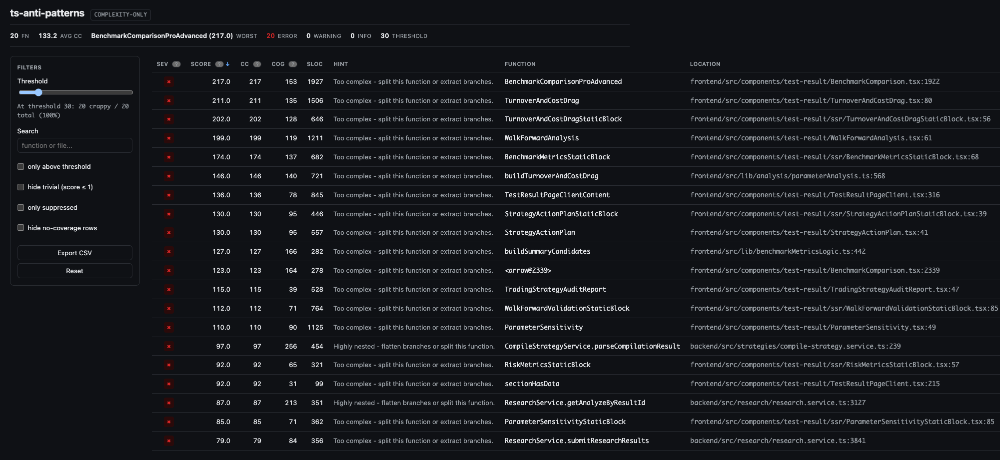

# ts-anti-patterns

## Token-Aware Refactoring for AI Agents

Every file an agent reads costs tokens. On a 500-file TSX codebase that adds up
to millions of input tokens before a single line changes.
`ts-anti-patterns` cuts that bill: it ranks the riskiest functions first so the
agent opens only what matters - not the whole tree.

### The math

> Sample: 300 TSX components averaged ~10k tokens/file (~1 token per 3.2–3.5 chars).

Claude Code meters the same tokens as the API. **Claude Sonnet 4.6** (typical coding model):
**$3 / MTok input**, **$15 / MTok output** - [Anthropic pricing](https://platform.claude.com/docs/en/about-claude/pricing).
Input costs below; output not included (refactor replies add on top).

| Approach | Input (≈) | vs. full read | Cost (≈) | Saved |
|---|---:|---|---:|---:|
| Read all 500 files | 5M | 💰 baseline | **$15.00** | - |
| ts-anti-patterns report → pick targets | ~60k | **83× less** 💰 | **$0.18** | **$14.82** 💰 |
| Report + 20 worst files (whole) | ~260k | **19× less** 💰 | **$0.78** | **$14.22** 💰 |
| Report + 20 function slices (`file:line`) | ~90k | **55× less** 💰 | **$0.27** | **$14.73** 💰 |

One function slice ≈ 1.5k tokens. Fat components can hit 30k+ each -
CRAP score finds the hotspot inside, line count doesn't.

**Profit:** one scouting pass with `ts-anti-patterns` instead of reading every file keeps **~$15 in input cost** - before you pay for a single line of agent output. On a **10-pass refactor** that's **~$150** of input you never burn just finding where to start.

### Why run it before an agent pass

- **Spend tokens on complexity, not volume** - fix ranked hotspots, not 500 full files
- **Precise entry points** - `file:line` lets the agent read a 1.5k-token slice, not a 30k-token component
- **Machine-readable output** - JSON / Markdown / HTML parsed before the agent opens a single file

### What is CRAP?

**Change Risk Anti-Patterns** combines cyclomatic complexity with test coverage into one score -
high CRAP = high complexity + low coverage = exactly where bugs hide.

```
CRAP(m) = comp(m)² × (1 − cov(m)/100)³ + comp(m)
```

When no coverage data is provided, `ts-anti-patterns` falls back to a CC-only mode and uses cyclomatic complexity as the score.



## Install

```bash
npm install -g ts-anti-patterns
```

Or use **`npx`** without installing (recommended for one-off checks and CI):

```bash
npx ts-anti-patterns@latest ./src
```

## Using with npx

Run from your project root (where `package.json` and `src/` live). No global install required.

### CC-only (default, no coverage)

```bash
# Scan ./src (auto-detected if you omit the path)
npx ts-anti-patterns@latest

# Explicit path
npx ts-anti-patterns@latest ./src

# HTML report in the current directory
npx ts-anti-patterns@latest ./src --format html --output crap-report.html

# CI gate (exit 1 if anything is above threshold)
npx ts-anti-patterns@latest ./src --threshold 30 --fail-above --summary
```

### Full CRAP (with coverage)

```bash
# One command: try to run tests with coverage, then analyze
npx ts-anti-patterns@latest --full

# Or generate coverage yourself, then analyze
npm run test:coverage
npx ts-anti-patterns@latest --cov

# Explicit coverage file
npx ts-anti-patterns@latest --lcov coverage/lcov.info --format html --output crap-report.html
```

### Custom coverage command (monorepos, pnpm, turbo, etc.)

```bash
npx ts-anti-patterns@latest --full --coverage-command "pnpm test -- --coverage"
```

### Pin a version (CI)

```bash
npx ts-anti-patterns@1.0.0 ./src --threshold 30 --fail-above
```

### Install agent skill (Cursor / compatible agents)

`ts-anti-patterns` ships a bundled `SKILL.md` so agents know how to run analysis. Install it with `npx` (no global install needed):

```bash
# User-wide (recommended once per machine)
npx ts-anti-patterns@latest skill install

# Only for the current repo (commit .agents/skills/ts-anti-patterns/SKILL.md if you want the team to share it)
npx ts-anti-patterns@latest skill install --project
```

Other skill commands:

```bash
# Show where the skill file would be / is installed
npx ts-anti-patterns@latest skill path
npx ts-anti-patterns@latest skill path --project

# Print bundled skill content
npx ts-anti-patterns@latest skill show

# Remove installed skill
npx ts-anti-patterns@latest skill uninstall
npx ts-anti-patterns@latest skill uninstall --project
```

**Paths:**

| Scope | Location |
|---|---|
| Global | `~/.agents/skills/ts-anti-patterns/SKILL.md` |
| Project | `./.agents/skills/ts-anti-patterns/SKILL.md` |

**Cursor:** agents read skills from `.agents/skills/`. After `skill install`, open a new chat so the skill is picked up. Some setups also use `~/.cursor/skills/` - if needed, symlink:

```bash
ln -s ~/.agents/skills/ts-anti-patterns ~/.cursor/skills/ts-anti-patterns
```

### Local development (this repo)

If you are hacking on `ts-anti-patterns` itself, use the built CLI:

```bash
npm run build
node dist/cli.js ./src --format html --output crap-report.html
```

Or from another project, point `npx` at the folder:

```bash
npx /path/to/ts-anti-patterns/dist/cli.js ./src
```

## Quick Start - CC-only (no coverage needed)

```bash
# Scan a folder
ts-anti-patterns ./src

# Multiple paths (shell glob expansion)
ts-anti-patterns ./src/* ./packages/*/src

# CI gate
ts-anti-patterns ./src --threshold 30 --fail-above
```

The CLI auto-detects `./src` if no path is given.
By default, reports show the top 20 worst results; override with `--top`.

## Quick Start - full CRAP mode

One command (auto-generate coverage, then analyze):

```bash
ts-anti-patterns --full
```

Generate coverage with any standard runner - then enable it with `--cov`
for auto-detect (or pass an explicit file):
`coverage/lcov.info`, `coverage/coverage-final.json`,
`coverage/coverage-summary.json`, `coverage/clover.xml`, or
`coverage/cobertura-coverage.xml`:

```bash
# Vitest
npx vitest run --coverage --coverage.reporter=lcov
# or c8
npx c8 --reporter=lcov npm test
# or Jest
npx jest --coverage --coverageReporters=lcov

# Then run one of:
ts-anti-patterns --cov                        # auto-detects and scores CRAP
ts-anti-patterns --run-coverage --cov         # generate coverage first, then score
ts-anti-patterns --full                       # shorthand: run coverage + CRAP analysis
ts-anti-patterns --full --coverage-command "pnpm test -- --coverage"  # custom command
ts-anti-patterns --lcov coverage/lcov.info    # explicit path (exit 2 if missing)
ts-anti-patterns                              # default CC-only (no coverage)
ts-anti-patterns --source-map auto            # for transpiled coverage (dist → src)
```

Coverage priority: **branch (BRDA) > function (FN/FNDA) > line-range
fallback**. Each row carries a confidence indicator: ● exact, ◐ range,
○ none. When some functions have no coverage data, the `--missing`
policy chooses how to score them:

| Policy        | Effect                                             |
| ------------- | -------------------------------------------------- |
| `pessimistic` | unmatched = 0 % (default - punishes blind spots)   |
| `optimistic`  | unmatched = 100 % (kind to noisy excludes)         |
| `skip`        | drop unmatched rows from the report                |

## Options

| Flag | Default | Purpose |
|---|---|---|
| `[...paths]` | `./src` (auto) | One or more files/dirs to analyze |
| `--threshold <n>` | `30` | Score above which a function is flagged |
| `--fail-above` | off | Exit 1 if any function ≥ severity threshold |
| `--fail-above-severity <sev>` | `warning` | `info` \| `warning` \| `error` |
| `--top <n>` | `20` | Show only N worst offenders |
| `--min <n>` | - | Hide entries below this score |
| `--format <fmt>` | `human` | `human` \| `json` \| `html` \| `markdown` \| `github` \| `sarif` \| `pr-comment` |
| `--output <path>` | stdout | Write to file instead of stdout |
| `--exclude <glob>` | - | Exclude glob (repeatable, `.gitignore`-aware) |
| `--allow <glob>` | - | Allow-list glob (repeatable) |
| `--cov` | off | Enable auto-detection from `coverage/*` |
| `--full` | off | One-command mode: generate coverage then analyze |
| `--run-coverage` | off | Generate coverage before analysis |
| `--coverage-command <cmd>` | auto | Custom command used by `--run-coverage` / `--full` |
| `--lcov <path>` | - | Explicit LCOV file (exit 2 if missing) |
| `--coverage <path>` | - | Explicit coverage file (lcov/json-summary/clover/cobertura) |
| `--source-map <auto\|dir>` | - | Translate coverage through source maps (`dist/*.js → src/*.ts`) |
| `--missing <policy>` | `pessimistic` | `pessimistic` \| `optimistic` \| `skip` |
| `--no-cov` | on | Force CC-only mode |
| `--skip-anonymous` | off | Hide `<arrow@N>` / `<fn@N>` rows |
| `--count-nullish-coalescing` | off | Count `??` as a branch in CC + cognitive |
| `--no-cognitive` | - | Skip cognitive-complexity computation |
| `--no-hints` | - | Suppress per-function actionable hints |
| `--baseline <path>` | - | Compare against a saved JSON report |
| `--fail-regression` | off | Exit 1 when any regression vs baseline is detected |
| `--epsilon <n>` | `0.01` | Score delta treated as unchanged for `--baseline` |
| `--summary` | off | Print only the aggregate headline (no table) |
| `--diagnose <file>` | - | Debug one file: every AST function + why it was kept/filtered |
| `--workspace` | off | Scan each package in `package.json#workspaces` |
| `--watch` | off | Re-render in human format on changes (debounced 200ms) |
| `--no-cache` | - | Disable the `.ts-anti-patterns-cache/` AST cache |
| `--jobs <n>` | `os.cpus()` | Parallel file-analysis concurrency |
| `--config <path>` | discovered | Path to a config file |

## Subcommands

| Command | Description |
|---|---|
| `ts-anti-patterns skill <install\|uninstall\|show\|path>` | Install bundled agent skill (`--project` for repo-local). |
| `ts-anti-patterns init` | Create `.ts-anti-patterns.json` and add an `crap` script to `package.json`. Idempotent. |
| `ts-anti-patterns explain <term>` | Print the glossary entry for `crap`, `cc`, `cognitive`, `coverage`, `confidence`, `severity`, `missing`, or `pragma`. |
| `ts-anti-patterns explain` | List every glossary term. |

## Output Formats

- **`human`** (default) - colorized terminal table with summary, hints, and a sticky `Δ since last run` line.
- **`json`** - `report-v1` envelope: stable shape suitable for `--baseline` later.
- **`html`** - single self-contained file, no network. Severity colors, threshold slider, search, suppressed/no-coverage toggles, glossary popovers, CSV export, dark mode, print stylesheet.
- **`markdown`** - GFM table with severity emoji. Drops into PR descriptions cleanly.
- **`github`** - Actions annotations (`::error`, `::warning`, `::notice`).
- **`sarif`** - SARIF 2.1.0 for GitHub Code Scanning.
- **`pr-comment`** - markdown with `<!-- ts-anti-patterns-report -->` marker so a bot can update the same comment in place. With `--baseline`, regressions go on top.

## Documentation Index

- [`.github/docs/architecture.md`](./.github/docs/architecture.md) - architecture and design decisions.
- [`.github/docs/contributing.md`](./.github/docs/contributing.md) - tests, PR checklist, release smoke.
- [`examples/github-actions-ci.yml`](./examples/github-actions-ci.yml) - CI gate + SARIF + PR comment.
- [`examples/lefthook.yml`](./examples/lefthook.yml) - local pre-push gate.
- [`schemas/report-v1.json`](./schemas/report-v1.json) - JSON report contract.
- [`schemas/delta-v1.json`](./schemas/delta-v1.json) - baseline diff contract.

## Programmatic API

```ts
import { analyze, renderHtml, computeCrap, GLOSSARY } from "ts-anti-patterns"

const { entries, meta } = await analyze({
  paths: ["src"],
  threshold: 30,
  noCov: true,
})
const html = await renderHtml(entries, meta, { threshold: 30 })
```

Every renderer (`renderHuman`, `renderJson`, `renderHtml`, `renderMarkdown`, `renderGithub`, `renderSarif`, `renderPrComment`) and scoring primitive (`computeCrap`, `scoreOf`, `severityOf`) is re-exported from the package root.

## CI Quick Start

- **PR gate:** `ts-anti-patterns --threshold 30 --fail-above --summary`
- **Regression gate:** `ts-anti-patterns --cov --baseline baseline.json --fail-regression --format json`
- **Code Scanning:** `ts-anti-patterns --cov --format sarif --output ts-anti-patterns.sarif`
- **PR comment:** `ts-anti-patterns --cov --baseline baseline.json --format pr-comment --output ts-anti-patterns.md`

For complete workflows, copy examples from [`examples/`](./examples/).

## Severity Bands

| Severity | Score | Default behavior |
|---|---|---|
| `ok` | ≤ threshold/2 | clean |
| `info` | ≤ threshold | "borderline, watch it" |
| `warning` | ≤ 2 × threshold | triggers `--fail-above` |
| `error` | > 2 × threshold | triggers `--fail-above` |

## Config File

Discovered via cosmiconfig in this order: `.ts-anti-patterns.json`, `.ts-anti-patterns.yaml`, `ts-anti-patterns.config.{js,cjs,mjs,json}`, or a `ts-anti-patterns` key in `package.json`.

```json
{
  "threshold": 30,
  "exclude": ["**/legacy/**"],
  "skipAnonymous": false,
  "countNullishCoalescing": false,
  "failAboveSeverity": "warning"
}
```

CLI flags always override the config.

[`cargo-crap`](https://github.com/minikin/cargo-crap) - Rust implementation of the CRAP metric.

## License

MIT
